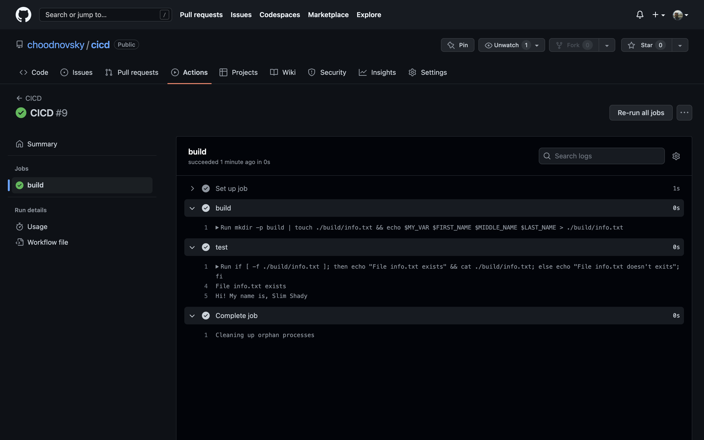

__Ход выполнения задания__

1. В gitlab столкнулся с проблемами с раннером решил все сделать в github в похожем сервисе `Actions`
2. В специальной папке репозитория `.github/workflows` создаю файл  [job.yml](.github/workflows/job.yml)
3. Для каждой задачки создается свой отдельный ранер -  VM ubuntu
4. Шаги выполняются последовательно, в конце ранер удаляется
5. Для демонстрации выставляю ручной способ запуска, но можно и по __cron schedule__ или __push requests__
6. В итоге все требуемые шаги выполняются 
